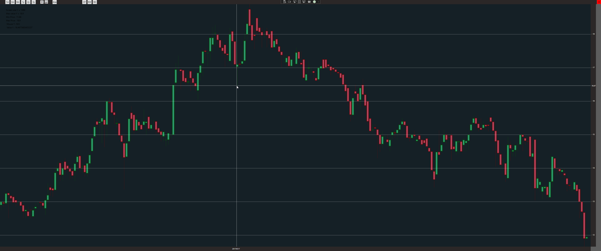

# BoostTrader

A trading charter to visualize stock prices trends by candle charts.

## General Information

My old app written somewhere in 2018 during my C# learnings but solving my problem with free chart visualization of polish stocks.

## Branches

* main branch consist newest release.
* release_{number} branch cover release with number {number}.
* other branches according to its description

## Technologies Used

* WPF
* .NET 4.8
* C#

## Features

* Candle charts visualization of polish stocks and invest funds.
* Chart time frames available: 1 month - 3 years

## Screenshot

## Prerequisities

To build project you need to install :
* visual Studio 2019 or higher.

## Creator

Created by Lukas Zlocki  
